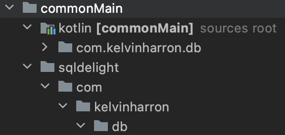

A short one for today, hopefully saving someone suffering the time I spent working out this one!

## What is SQLDelight?

[SQLDelight](https://github.com/cashapp/sqldelight) is a library that generates type-safe Kotlin APIs from SQL statements that in the context of KMM, can help us provide the one database layer for iOS and Android.

Between the [SQLDelight Kotlin tutorial](https://kotlinlang.org/docs/multiplatform-mobile-configure-sqldelight-for-data-storage.html) and the excellent [KaMPKit](https://github.com/touchlab/KaMPKit), I've been working towards practical examples of how working in KMM could benefit a team with something like SQLDelight (version 1.5.3).

### The problem

As part of the setup for SQLDelight, we'll need to provide dependencies for each sourceset. The problem began on the [kotlinlang](https://kotlinlang.org/docs/multiplatform-mobile-configure-sqldelight-for-data-storage.html#configuration) tutorial Configuration section where it states the following:

> To configure the SQLDelight API generator, use the sqldelight top-level block of the build script. For example, to create a database named AppDatabase and specify the package name com.example.db for the generated Kotlin classes, use this configuration block:
> ```
> sqldelight {
>    database("AppDatabase") {
>        packageName = "com.example.db"
>    }
> ```

Seems pretty straightforward, I said to myself until `Unresolved reference: AppDatabase` would come up again and again on each build attempt!

### The cause

SQLDelight generates type-safe APIs for us but because the package does not exist for any `.sq` files at the package `com.example.db`, the AppDatabase will not get generated. Unfortunately, the documentation is rather implicit in this regard.

### The solution

In your commonMain root, create a directory and name it `sqldelight`. From there, depending on your packageName value in your configuration block, create a nest of directories as pictured:



In the `db` directory (as my example), create a new file called `Table.sq` and sync, then build your project.

Now you should be able to create a `DatabaseHelper.kt` (or name of your preference) in the root Kotlin commonMain directory and get a reference to the `AppDatabase` as generated from your configuration with something like `val database = AppDatabase`.

Thanks to [AlecStrong](https://github.com/cashapp/sqldelight/discussions/2809#discussioncomment-2118100) for keeping me right on this one. I'll get back to you on what working with SQLDelight is like. 